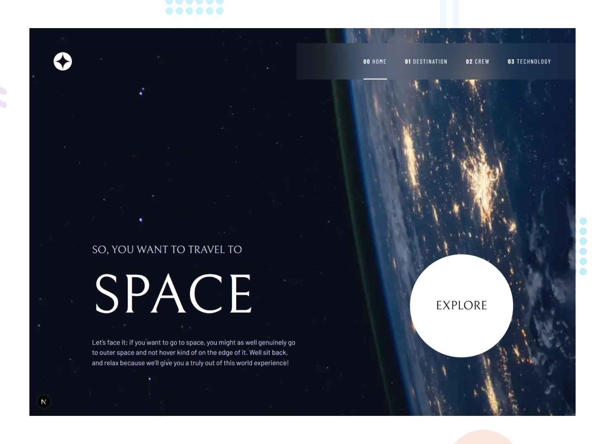

## Frontend Mentor - Space Tourism App Solution

This is a solution to the [Space tourism website challenge on Frontend Mentor](https://www.frontendmentor.io/challenges/space-tourism-multipage-website-gRWj1URZ3). Frontend Mentor challenges help you improve your coding skills by building realistic projects.

<p>
  <a href="https://www.frontendmentor.io/solutions/static-site-generation-with-nextjs-mobile-first-responsive-Ala9Eyc1bh">
    </a>
  <a href="https://haquanq-frontendmentor.github.io/space-tourism-app/">
    </a>
  <a href="./LICENSE"
    ></a>
</p>

## Table of Contents

- [Project Overview](#sunrise-project-overview)
- [Tech Stack and Approach](#stars-tech-stack-and-approach)
- [Local Development](#leaves-local-development)
- [Deployment](#maple_leaf-deployment)

## :sunrise: Project Overview

### Challenge Requirements

- View the optimal layout for each of the website's pages depending on their device's screen size
- See hover states for all interactive elements on the page
- View each page and be able to toggle between the tabs to see new information

### Status

Accessibility

- [x] Responsive accross different screen sizes
- [x] Added custom indicator when interactive elements focused

### Preview



## :stars: Tech Stack and Approach

### Built with

- **HTML5** – Semantic structure
- **Next/React** – SEO focused, static sites generation
- **TailwindCSS** – Utility-first CSS for fast development
- **TypeScript** - Interactivity and application logic
- **EmblaCarousel** - Simple carousel interactivity logic

### Approach

- Mobile-first workflow for better performance on smaller devices
- Accessibility guided by [ARIA Authoring Practices Guide (APG)](https://www.w3.org/WAI/ARIA/apg/).

## :leaves: Local Development

### Prerequisites

Install the following:

- Git (latest version)
- Node.js (latest LTS recommended)
- pnpm (latest version)

### Setup

```
git clone https://github.com/haquanq-frontendmentor/space-tourism-app.git
cd space-tourism-app
pnpm install
```

### Start Development Server

```
pnpm dev
```

## :maple_leaf: Deployment

Deployed to Github Pages via Github Actions (manually triggered).
